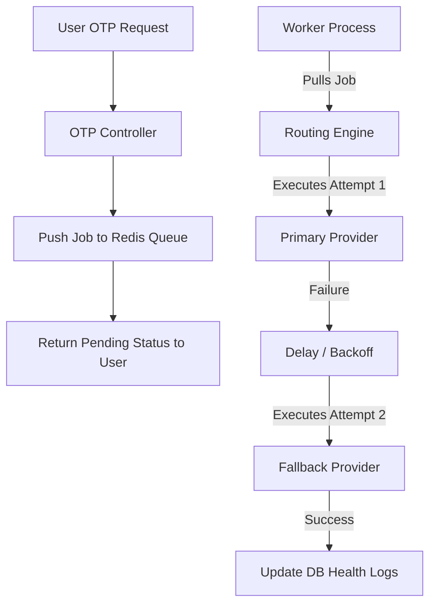

# WPA Central Auth Communication Provider System

The WPA Central Auth communication provider system is a secure, resilient, and multi-channel system for delivering one-time passwords (OTP), authentication alerts, and system notifications. It features DB-managed encrypted credentials, customizable routing rules, and multi-provider fallback layers.

---

## 1. Local Smoke Test Steps

A node-based automated smoke test script is located in `scratch/communication_smoke_test.js`. To execute the API smoke tests:

1. Ensure the backend API server is running on `http://localhost:5010`.
2. Set the seed admin details in `wpa_auth_api/.env`:
   ```bash
   SEED_ADMIN_EMAIL=admin@wpa.com
   SEED_ADMIN_PASSWORD=Password123!
   ```
3. Run the smoke test runner command from the `wpa_auth_api` folder:
   ```bash
   node scratch/communication_smoke_test.js
   ```

The script verifies:
- Authenticated login and token retrieval.
- Reading and writing communication providers and credentials.
- Validating encryption of credentials and verification of secret masking.
- Sending test emails and verifying delivery log generation.
- Correct deactivation, activation, and permission boundary validation.

---

## 2. Manual Browser QA Checklist

1. **View Inventory:** Open the admin panel at `/communication/sms-providers` and `/communication/email-providers`. Ensure loading and empty states render gracefully.
2. **Add Provider:** Click "Add Provider". Fill in details. Ensure that:
   - SMS provider requires an endpoint URL.
   - Email provider forms validate host, port, and security settings.
3. **Save Credentials:** Save the provider. Verify that credentials are saved to the DB and only the masked secret preview (e.g. `******`) is returned. No raw secret should be editable or visible.
4. **Trigger Connectivity Test:** Click "Test" on a provider row. Enter your phone number/email and click "Run Test".
   - The test updates the `Last Test` status badge (`PASSED` or `FAILED`).
   - Detailed connectivity diagnostics are saved to the provider's test log.
5. **Update Routing Rules:** Navigate to `/communication/routing-rules`. Assign primary and fallback order by priority. Verify that priorities are mapped correctly in the routing list.

---

## 3. Provider Setup Examples (No Real Secrets)

### SMS HTTP Provider (GET/POST)
- **Method:** `POST`
- **Endpoint:** `https://api.sms-gateway.com/send?to={{to}}&msg={{message}}`
- **Secrets Config:**
  ```json
  {
    "apiKey": "your_api_key_placeholder",
    "senderId": "WPALTD",
    "headers": "{\"Authorization\": \"Bearer mock_token\"}"
  }
  ```

### Email SMTP Provider
- **SMTP Host:** `smtp.mailtrap.io`
- **SMTP Port:** `2525`
- **Secure:** `false`
- **Secrets Config:**
  ```json
  {
    "username": "smtp_username_placeholder",
    "password": "smtp_password_placeholder"
  }
  ```

---

## 4. SMS Routing Examples

### Scenario A: BD Local Provider Success
1. User requests OTP for `+8801712345678`.
2. Country prefix is detected as `880` (BD).
3. Routing engine looks for rules matching country code `880`. It finds a rule with `Primary: BD-SMS-Local` and `Priority: 1`.
4. The system executes `BD-SMS-Local`. The delivery is successful, health counters increment, and a `SENT` delivery log is recorded.

### Scenario B: BD Local Fail ➔ Global Fallback
1. User requests OTP for `+8801712345678`.
2. Routing finds `Primary: BD-SMS-Local` and `Fallback: Global-Twilio`.
3. `BD-SMS-Local` fails (connection timeout). The failure count is incremented, and its health is degraded.
4. The routing engine automatically falls back to `Global-Twilio`.
5. `Global-Twilio` succeeds. The final status is marked `RETRIED` in delivery logs.

### Scenario C: No Country Provider ➔ Global Provider
1. User requests OTP for `+447911123456` (UK).
2. Country prefix `44` has no matching country-specific routing rules in the database.
3. Routing engine queries global providers (`isGlobal: true`) or rules with `countryCode: null`.
4. It resolves to the primary global provider `Global-Twilio` and delivers the SMS.

---

## 5. Email Fallback Examples

### Scenario: SMTP 1 Fail ➔ SMTP 2 Success
1. System attempts to send registration verification email via `Mailgun-SMTP` (Primary).
2. `Mailgun-SMTP` fails with an authentication error.
3. The routing engine catches the error, records a `FAILED` attempt log for `Mailgun-SMTP`, and decrements its health status.
4. The routing engine automatically invokes the next fallback provider, `SES-SMTP` (Secondary).
5. `SES-SMTP` succeeds. The system records a `SENT` attempt log, and return success to the user.

---

## 6. Security Checklist
- [x] **No Secret Leakage:** Decrypted secrets are never logged, stored in audit records, or returned in API responses.
- [x] **Masked Previews:** Credential payloads show only truncated key previews (`ap****` or `********` for passwords).
- [x] **Privileged Actions:** Credential management requires `communication.credentials.manage` permission.
- [x] **Sanitized Errors:** Internal SMTP network tracebacks and API exception details are hidden from public API responses, but stored internally in the delivery log database table for debugging.

---

## 7. Future Queue/Worker Retry Architecture

For production environments handling millions of requests, inline execution should be replaced by a background queue system (e.g. BullMQ / Redis):



### Key Recommendations
1. **Concurrency Control:** Set concurrency limits per provider to avoid rate limiting.
2. **Exponential Backoff:** Use exponential delays between attempts (e.g. 5s, 15s, 60s) for non-OTP alerts. For OTP, immediate fallbacks must remain inline.
3. **Dead Letter Queue (DLQ):** Route persistently failing notifications to a DLQ for administrator review.

---

## 8. Vendor-Specific Adapter Extension Guide

To add a new vendor-specific API (e.g. Twilio REST or SendGrid Web API):

1. **Define Adapter:** Add a new class in `src/modules/communication/communication.adapters.ts`:
   ```typescript
   class TwilioSmsAdapter implements SmsProviderAdapter {
     async sendSms(input: SmsSendInput): Promise<ProviderSendResult> {
       // Custom payload wrapping and Twilio API invocation...
     }
   }
   ```
2. **Register Adapter:** Update the `resolveSmsAdapter` resolver:
   ```typescript
   export function resolveSmsAdapter(providerCode: string): SmsProviderAdapter {
     if (providerCode === 'TWILIO') return new TwilioSmsAdapter();
     return genericHttpSmsAdapter;
   }
   ```
